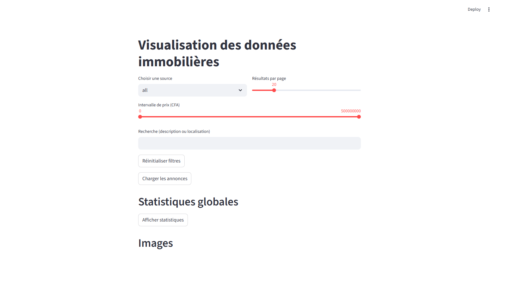
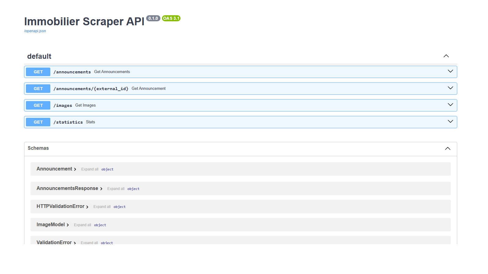

# Real Estate Data Pipeline - Togo

Pipeline de collecte et de diffusion d'annonces immobilières togolaises.
Le projet combine ingestion de données, stockage structuré MySQL, API REST (FastAPI) et tableau de bord Streamlit.

## Executive Summary

Ce projet répond à un besoin simple: centraliser des annonces immobilières multi-sources dans un format exploitable pour la recherche, l'analyse et la visualisation.

Points forts:
- ingestion de plusieurs sources avec normalisation des champs,
- persistance relationnelle via SQLAlchemy + MySQL,
- API REST paginée avec filtres (source, prix, recherche texte),
- exécution planifiée toutes les 20 minutes avec APScheduler,
- interface Streamlit pour consultation rapide.

## Architecture

```text
JSON sources (Coin Afrique, IGOE, Intendance)
            |
            v
 DonneesScrapper/python.py (extraction + normalisation)
            |
            v
 DonneesScrapper/Scheduler.py (orchestration périodique)
            |
            v
 Application/models.py + database.py (SQLAlchemy + MySQL)
            |
            +--> Application/api.py (FastAPI)
            |
            +--> streamlit_app.py (dashboard)
```

## Stack Technique

- Python 3.8+
- SQLAlchemy 2.x
- MySQL 8+ (driver PyMySQL)
- APScheduler
- FastAPI + Uvicorn
- Streamlit

Dépendances: voir `requirements.txt`.

## Sources de Données

- Coin Afrique: https://tg.coinafrique.com/categorie/immobilier
- IGOE Immobilier: https://www.igoeimmobilier.com/
- Intendance.tg: https://intendance.tg/

Fichiers d'entrée disponibles dans `DonneesScrapper/` (`*.json`, `*.csv`).

## Structure du Projet

```text
Application/
├── api.py
├── database.py
├── importer.py
├── main.py
└── models.py

DonneesScrapper/
├── python.py
├── Scheduler.py
└── *.json / *.csv

streamlit_app.py
requirements.txt
.env.example
README.md
```

## Modèle de Données

Tables principales:
- `real_estate_announcements`
- `coinafrique_announcements`
- `igoe_announcements`
- `intendance_announcements`
- `images`

Champs clés d'une annonce:
- `external_id` (unique)
- `source`
- `price`, `price_numeric`
- `location`, `description`
- `images`, `citations` (JSON)
- `source_url`
- `scraped_at`, `updated_at`

## Quick Start

### 1. Installer les dépendances

```bash
pip install -r requirements.txt
```

### 2. Configurer MySQL

Configuration actuelle du projet:

```python
# Application/database.py
DATABASE_URL = "mysql+pymysql://root@localhost/scrapperDonnee_db"
```

Créer la base si nécessaire:

```sql
CREATE DATABASE scrapperDonnee_db;
```

### 3. Lancer le pipeline de scraping

```bash
python -m Application.main
```

Comportement au démarrage:
1. création des tables (si absentes),
2. scraping initial,
3. planification automatique toutes les 20 minutes.

### 4. Lancer l'API FastAPI

```bash
uvicorn Application.api:app --reload --port 8000
```

- Docs FastAPI: http://localhost:8000/docs

### 5. Lancer le dashboard

```bash
streamlit run streamlit_app.py
```

## Aperçu Visuel

### 1) Interface Streamlit



### 2) Documentation API FastAPI (Swagger)



### 3) Réponse API `/announcements`


## Référence API FastAPI

### `GET /announcements`
Filtres disponibles:
- `source`
- `page`
- `per_page`
- `min_price`
- `max_price`
- `q` (texte sur description/localisation)

Exemple:

```bash
curl "http://localhost:8000/announcements?source=Coin-Afrique&page=1&per_page=10"
```

### `GET /announcements/{external_id}`
Retourne une annonce par identifiant externe.

### `GET /images`
Retourne la liste des images (avec `source` et `limit` en option).

### `GET /statistics`
Retourne les compteurs par table/source.

## Résultats Obtenus

Résultats observés sur les données actuellement exportées (`Application/exports/`):

- Annonces intégrées (`real_estate_announcements`): **34**
- Source dominante: **Coin-Afrique (34 annonces)**
- Prix moyen: **66 358 823 CFA**
- Médiane des prix: **37 500 000 CFA**
- Fourchette observée: **4 000 000 CFA** à **450 000 000 CFA**
- Percentile 90 (P90): **~165 000 000 CFA**

Remarque:
- Les sources `igoe-immobilier` et `intendance-tg` sont présentes dans le pipeline, mais à **0** dans l'export courant.

## Exemples SQL (Analyse)

```sql
-- Répartition des annonces par source
SELECT source, COUNT(*) AS count
FROM real_estate_announcements
GROUP BY source;

-- Top 10 des annonces les plus chères
SELECT location, price, price_numeric
FROM real_estate_announcements
ORDER BY price_numeric DESC
LIMIT 10;

-- Dernières annonces intégrées
SELECT *
FROM real_estate_announcements
ORDER BY scraped_at DESC
LIMIT 5;
```

## Qualité et Limites Actuelles

Ce qui est déjà en place:
- ingestion résiliente (tolérance à l'absence de certains fichiers),
- upsert logique (création/mise à jour),
- API paginée exploitable côté front.

Améliorations possibles:
- configuration via variables d'environnement (URL DB, intervalle scheduler),
- tests automatisés (unitaires + intégration),
- conteneurisation (Docker Compose: API FastAPI + MySQL + Streamlit),
- observabilité (logs structurés, métriques de job),
- CI/CD pour validation automatique.

## Dépannage

### Erreur de connexion MySQL
Vérifier:
- que MySQL est démarré,
- que `DATABASE_URL` est correct,
- que `scrapperDonnee_db` existe.

### Aucun résultat dans l'API FastAPI
Vérifier:
- que le job initial s'est exécuté,
- que les fichiers JSON sont présents dans `DonneesScrapper/`,
- les logs de `Application/main.py`.

### Dashboard Streamlit vide
Vérifier:
- que l'API FastAPI tourne sur `http://localhost:8000`,
- que l'endpoint `/announcements` retourne des données.

---

## Auteur

INGGBAA

## Version

1.2 (Portfolio Edition) - 2 mars 2026

